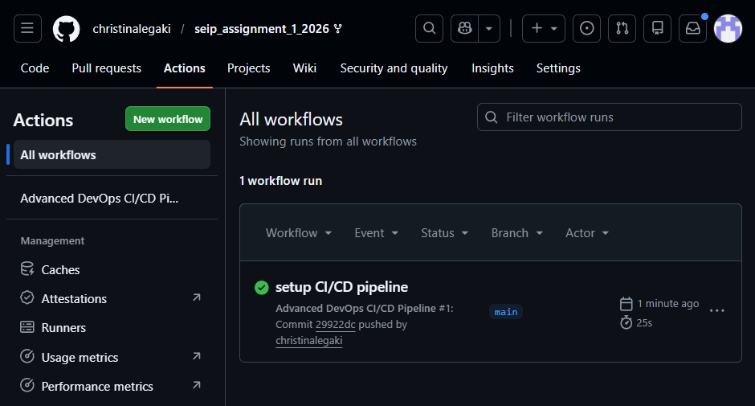
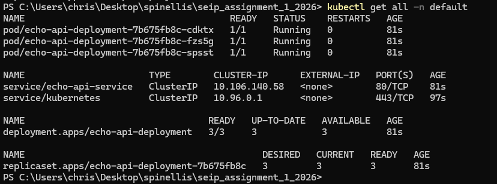
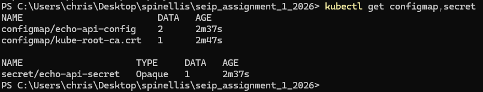
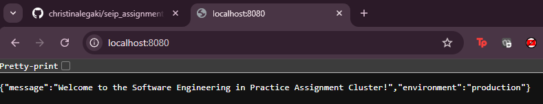
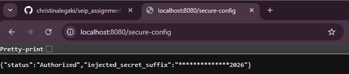

# Software Engineering in Practice — Assignment 1 (2026)
## Lab Assignment 1 - Advanced DevOps: Production-Grade CI/CD, External Configuration, and Orchestration

- **Student Name:** Legaki Christina
- **Student ID:** 8230074
- **University:** Athens University of Economics and Business (AUEB)
- **Date:** June, 2026

## GitHub Repository Link

The public GitHub repository containing all application code, the GitHub Actions workflow file, and the complete `k8s/` configuration directory can be accessed here:

https://github.com/christinalegaki/seip_assignment_1_2026

## CI/CD Proof

Below is the verification from the GitHub Actions dashboard showing a successful build and push pipeline completion into the GitHub Container Registry (GHCR).

## Cluster State Proof

The section below contains the verification screenshots and raw outputs from the terminal executing the core cluster component configurations

### 1. Resource Enumeration (`kubectl get all -n default`)

Below is the terminal screenshot showing that all 3 replicas (pods) are successfully `Running` and healthy (`1/1 READY`), along with the active internal `ClusterIP` network exposing port 80.

### 2. Configuration Inspection (kubectl get configmap, secret)

Below is the terminal screenshot verifying that the configuration data objects (echo-api-config) and the encrypted payload secrets (echo-api-secret) are correctly applied to the control plane.

## Application Verification Proof

Screenshots of the browser workspace confirming successful operational responses through the local loopback port-forward tunnel interface:

### 1. Core Welcome Endpoint (http://localhost:8080/)

Fetches and renders the decoupled application environment settings and greeting from the cluster's active.

### 2. Secure Configuration Endpoint (http://localhost:8080/secure-config)

Confirms successful initialization and validation of the manually Base64 encoded secret injected into the running workload container context.

## AI Reflection & Future Outlook

### 1. AI Integration

Throughout this assignment, my primary engineering baseline relied heavily on the official laboratory slides and course material provided in class. Specifically, I utilized the Docker lab material to construct the optimized multi-layer Dockerfile syntax and caching strategy.

Additionally, the DevOps laboratory slides provided the foundational architectural templates and structures required to author the Kubernetes declarative deployments (deployment.yaml).

Generative AI (Google Gemini) was introduced strictly as a supplementary co-pilot to accelerate understanding of advanced edge-cases and mechanics I had not utterly comprehended. For instance, the AI suggested using a mockup value (SuperSecretKey2026) to safely demonstrate how a runtime secret is structured, base64-encoded, and injected without exposing real production credentials.

Furthermore, the AI assisted in structuring a comprehensive README.md file at the root of the repository to properly document the deployment workflows.

### 2. Utility Analysis

The Generative AI assistant proved highly effective in two main areas:

- Deepening Kubernetes Manifest Comprehension: While the course slides provided the essential building blocks, the AI was instrumental in helping me visualize and dissect the deeper mechanics of manifest structures. It clarified exactly how the control plane maps decoupled values from a ConfigMap or Secret into a container's running process variables at boot time.

- Explaining Base64 Mechanics: The AI provided precise, clear execution commands for terminal-level Base64 serialization using our mockup key (SuperSecretKey2026 transforming into U3VwZXJTZWNyZXRLZXkyMDI2). It explained how typical encoding utilities can accidentally inject trailing newline delimiters (\n) or spaces, and how to safely avoid them so that the Express application's API_SECRET_KEY matches perfectly upon decryption.

### 3. Friction Points & Manual Troubleshooting

The interaction with automated tools was smooth, and the roadblocks encountered were extremely minor configuration adjustments rather than system failures:

- Minikube VM & Docker Driver Connectivity: The only minor friction point emerged when executing minikube start, where the underlying Docker daemon pipe occasionally failed to respond immediately due to local environment driver settings (open //./pipe/dockerDesktopLinuxEngine).

- The Manual Fix: I easily bypassed this minor fault manually by verifying that Docker Desktop was fully running and active, and subsequently executing the PowerShell environment with elevated administrative privileges. This allowed Minikube to seamlessly mount its virtualization context. 

### 4. Future Architectural Outlook

If tasked with scaling this proof-of-concept into a resilient, production-grade enterprise system with an extra week of engineering, my roadmap would thoroughly address the production upgrades outlined in the assignment guidelines, while introducing a crucial custom optimization.

Beyond the proposed production implementations (Replacing Port-Forwarding with an Ingress Controller, Establishing a True GitOps Workflow with ArgoCD, Adding Prometheus Monitoring, Securing Image Scanning Inside the CI Pipeline) , a true enterprise architecture must handle dynamic traffic fluctuations.

Therefore, my primary additional proposal is to implement a Kubernetes Horizontal Pod Autoscaler (HPA). Instead of maintaining a rigid, static cap of exactly 3 replicas, the cluster would utilize the Kubernetes Metrics Server to automatically scale the pod instances up to 10 during high-traffic spikes and scale back down during low-use periods. This ensures continuous high availability while drastically optimizing cloud infrastructure resource costs.

